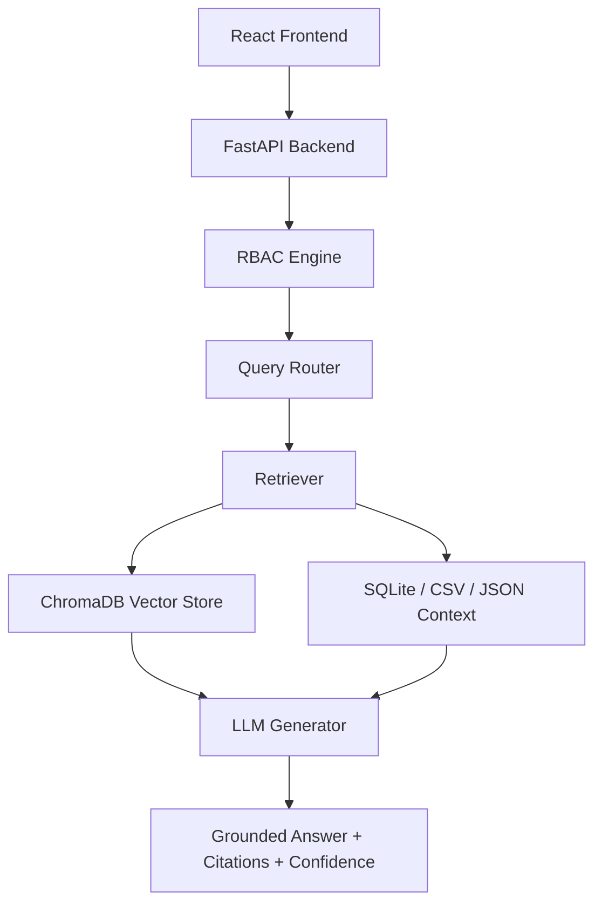

# VaultRAG AI

Enterprise Secure RAG Intelligence Platform with role-based access control, multi-source retrieval, auditable query traces, and Gemini-backed answer generation.

## Live Deployment

| Surface | URL |
| --- | --- |
| Frontend | `TBD - Vercel URL` |
| Backend API | `TBD - Render URL` |
| Health Check | `TBD - Render URL/health` |

## Features

- Secure FastAPI backend with RBAC-aware query execution
- React + Tailwind enterprise dashboard
- Gemini LLM integration with safe mock fallback for demos
- ChromaDB vector retrieval with offline deterministic embedding fallback
- Multi-source retrieval from PDF-style text, CSV, JSON, and SQLite data
- Query intent routing across HR, Finance, Engineering, Compliance, Security, and Deployment domains
- Citations, confidence score, retrieval trace, and access logs
- Demo accounts for Admin, Engineer, Finance, HR, and Compliance roles

## Architecture



See [docs/ARCHITECTURE.md](docs/ARCHITECTURE.md) for detailed diagrams.

## Tech Stack

- Backend: FastAPI, Uvicorn, Python, ChromaDB, SQLite
- Frontend: React, Vite, Tailwind CSS, Framer Motion, Lucide icons
- AI: Gemini API with local fallback behavior
- Data: enterprise policies, incident reports, server metrics, payroll, access logs, security alerts
- Deployment: Render for backend, Vercel for frontend

## RBAC System

VaultRAG AI enforces source-level access by role before retrieval and answer generation.

| Role | Typical Access |
| --- | --- |
| Admin | Full enterprise source access |
| Engineer | Incidents, deployments, server logs, metrics |
| Compliance Officer | GDPR, audit logs, security alerts, incident visibility |
| Finance Analyst | Budgets, expenses, audit reports |
| HR Manager | Employee policies, leave guidelines, attendance, payroll |

Denied sources are surfaced in the routing trace and blocked responses return an `ACCESS DENIED` message.

## Query Routing

The router detects intent from the query and maps it to candidate sources:

- Incident and outage queries route to incident reports, server logs, server metrics, deployment status, and security alerts.
- Security queries route to security alerts, access logs, server logs, compliance docs, and audit logs.
- Finance queries route to audit reports, budget summaries, department budgets, and expenses.
- HR queries route to policies, leave guidelines, attendance, and employee records.

The RBAC engine then filters candidate sources before retrieval.

## Multi-Source Retrieval

Retrieval combines:

- ChromaDB semantic search over chunked enterprise documents
- Structured CSV/JSON summaries
- SQLite context for incidents and employees when authorized
- Citations and trace snippets returned to the UI

## Demo Users

| Email | Password | Role |
| --- | --- | --- |
| `admin@vaultrag.ai` | `admin123` | Admin |
| `engineer@vaultrag.ai` | `eng123` | Engineer |
| `finance@vaultrag.ai` | `fin123` | Finance Analyst |
| `hr@vaultrag.ai` | `hr123` | HR Manager |
| `compliance@vaultrag.ai` | `comp123` | Compliance Officer |

## Example Queries

- Why did payroll processing fail last Friday?
- What caused the INC-2045 outage and what was the root cause?
- Show security anomalies from engineering logs.
- Summarize GDPR compliance policies.
- What is the current engineering budget status?

## Local Installation

### Backend

```bash
cp .env.example .env
pip install -r requirements.txt
uvicorn backend.app:app --host 0.0.0.0 --port 8000
```

### Frontend

```bash
cd frontend
cp .env.example .env
npm install
npm run dev
```

Open `http://localhost:5173`.

## Environment Variables

Never commit real secrets. Use `.env` locally and deployment provider environment variables in production.

Backend:

```env
GEMINI_API_KEY=your_api_key_here
CORS_ORIGINS=https://your-frontend-url.vercel.app
CHROMA_PERSIST_DIR=/tmp/chroma_db
DATABASE_URL=./datasets/sql/enterprise.db
```

Frontend:

```env
VITE_API_URL=https://your-backend-url.onrender.com
```

## Deployment

### Backend on Render

- Root directory: repository root
- Build command: `pip install -r requirements.txt`
- Start command: `uvicorn backend.app:app --host 0.0.0.0 --port $PORT`
- Health check path: `/health`
- Required environment variables:
  - `GEMINI_API_KEY`
  - `CORS_ORIGINS=https://your-frontend-url.vercel.app`
  - `CHROMA_PERSIST_DIR=/tmp/chroma_db`
  - `DATABASE_URL=./datasets/sql/enterprise.db`

### Frontend on Vercel

- Root directory: `frontend`
- Build command: `npm run build`
- Output directory: `dist`
- Environment variable:
  - `VITE_API_URL=https://your-backend-url.onrender.com`

## Folder Structure

```text
VaultRAG-AI/
├── backend/
│   ├── app.py
│   ├── database/
│   ├── ingestion/
│   ├── llm/
│   ├── rbac/
│   ├── retrieval/
│   └── routing/
├── datasets/
│   ├── csv/
│   ├── json/
│   ├── pdfs/
│   └── sql/
├── docs/
├── frontend/
│   ├── public/
│   └── src/
├── scratch/
├── screenshots/
├── render.yaml
├── requirements.txt
└── README.md
```

## Screenshots

Screenshots should be placed in `screenshots/` after final deployment:

- Login page
- Dashboard overview
- AI response
- Retrieval trace
- Citations and confidence score
- Access denied flow

## Security Notes

- `.env` files are ignored by Git.
- API keys must be configured only in Render/Vercel environment variables.
- RBAC filtering happens before retrieval and LLM generation.
- Access logs record query activity without storing secret values.
