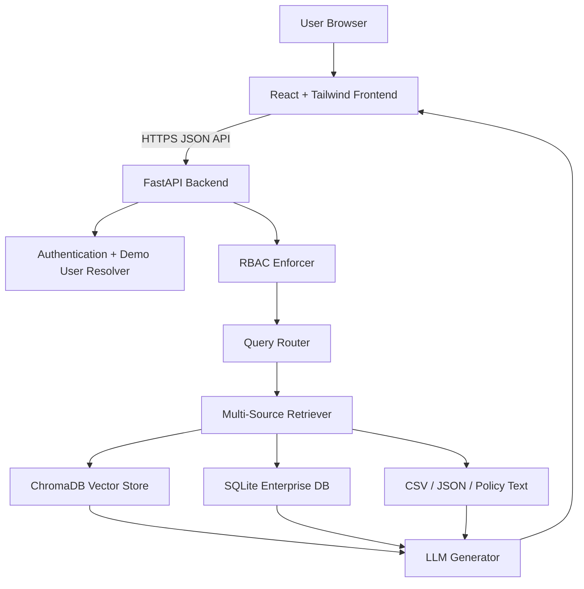
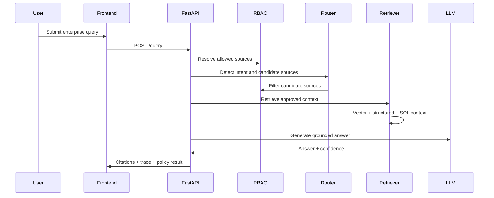
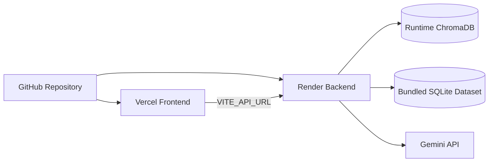

# VaultRAG AI Architecture

## System Architecture

## Backend Flow

## Deployment Architecture

## Data Boundaries

- The frontend never receives API keys.
- Render stores backend secrets as environment variables.
- Vercel stores only the public backend URL.
- RBAC filtering is applied before retrieval.
- ChromaDB is regenerated from bundled demo datasets at startup when needed.
